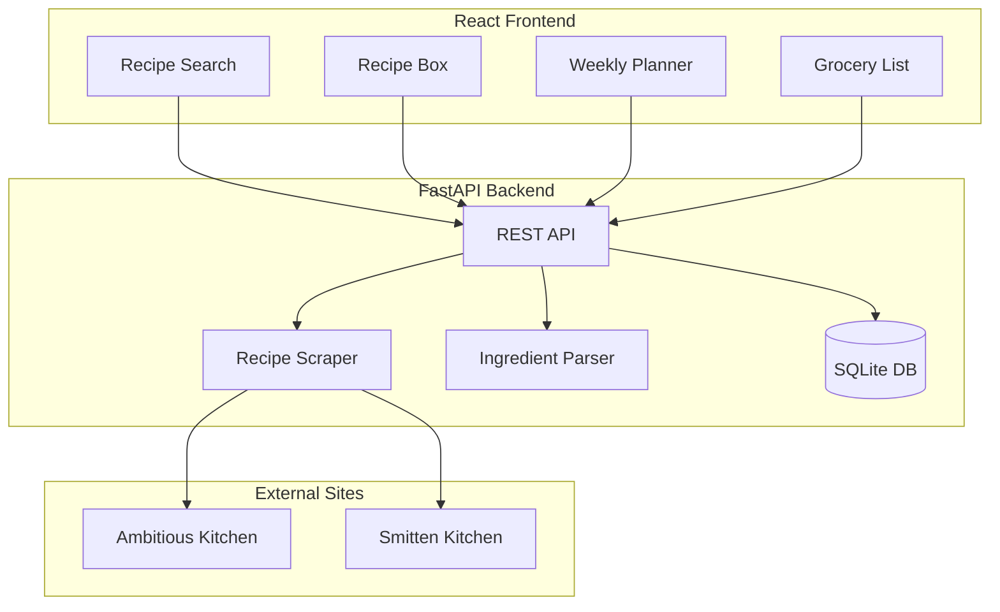

# Meal Planning & Grocery App

## Architecture Overview



## Project Structure

```
hack_day_project/
├── backend/
│   ├── app/
│   │   ├── main.py              # FastAPI app entry
│   │   ├── routers/
│   │   │   ├── recipes.py       # Recipe CRUD endpoints
│   │   │   ├── meal_plans.py    # Weekly planning endpoints
│   │   │   └── grocery.py       # Grocery list generation
│   │   ├── services/
│   │   │   ├── scraper.py       # Recipe scraping logic
│   │   │   └── ingredient_parser.py  # Parse & aggregate ingredients
│   │   ├── models.py            # SQLAlchemy models
│   │   └── database.py          # DB connection
│   ├── .env.example             # Environment template
│   ├── requirements.txt
│   └── tests/
├── frontend/
│   ├── src/
│   │   ├── components/
│   │   │   ├── RecipeSearch.tsx
│   │   │   ├── RecipeBox.tsx
│   │   │   ├── WeeklyPlanner.tsx
│   │   │   └── GroceryList.tsx
│   │   ├── pages/
│   │   ├── api/                 # API client
│   │   └── App.tsx
│   ├── package.json
│   └── vite.config.ts
└── README.md
```

## Backend Components

### 1. Recipe Scraper (`backend/app/services/scraper.py`)

- Use `httpx` for async HTTP requests
- Use `BeautifulSoup` to parse HTML
- Extract structured data from `<script type="application/ld+json">` (Recipe schema)
- Site-specific extractors for each supported site
- Fallback: Return partial data and flag for manual entry

**Supported extraction:**

- Recipe title, description, image URL
- Ingredients list (raw strings)
- Instructions
- Prep/cook time, servings

### 2. Ingredient Parser (`backend/app/services/ingredient_parser.py`)

- Parse quantities, units, and items from ingredient strings
- Normalize units (e.g., "tbsp" -> "tablespoon")
- Aggregate matching ingredients across recipes
- Handle edge cases: "2-3 cloves", "to taste", fractions

### 3. Database Models (`backend/app/models.py`)

- **Recipe:** id, url, title, description, image_url, ingredients (JSON), instructions, source_site, created_at
- **MealPlan:** id, week_start_date, day_of_week, recipe_id (FK)
- **RecipeBox:** id, recipe_id (FK), added_at (user's saved recipes)

### 4. API Endpoints

| Endpoint               | Method          | Description                      |
| ---------------------- | --------------- | -------------------------------- |
| `/api/recipes/scrape`  | POST            | Scrape recipe from URL           |
| `/api/recipes`         | GET             | List saved recipes               |
| `/api/recipes/{id}`    | GET/DELETE      | Get or delete recipe             |
| `/api/recipe-box`      | GET/POST/DELETE | Manage saved recipes             |
| `/api/meal-plans`      | GET/POST/PUT    | Weekly meal assignments          |
| `/api/grocery-list`    | POST            | Generate aggregated grocery list |

## Frontend Components

### 1. Recipe Search (`RecipeSearch.tsx`)

- Input field for recipe URL
- "Scrape Recipe" button triggers backend
- Display scraped recipe preview
- "Save to Recipe Box" button

### 2. Recipe Box (`RecipeBox.tsx`)

- Grid/list view of saved recipes
- Filter/search within saved recipes
- Click to view details, delete, or add to meal plan

### 3. Weekly Planner (`WeeklyPlanner.tsx`)

- 7-day calendar view (Mon-Sun)
- Drag-and-drop recipes from Recipe Box
- Multiple meals per day supported
- "Generate Grocery List" button for selected range

### 4. Grocery List (`GroceryList.tsx`)

- Aggregated ingredients with combined quantities
- Checkbox to mark items as purchased
- Copy to clipboard functionality
- Group by category (produce, dairy, pantry, etc.) - future enhancement

## Tech Stack Summary

**Backend:**

- Python 3.11+
- FastAPI + Uvicorn
- SQLAlchemy + SQLite (easy local dev, can upgrade to PostgreSQL)
- httpx, BeautifulSoup4, ingredient-parser-nlp

**Frontend:**

- React 18 + TypeScript
- Vite (fast dev server)
- React Router
- Tailwind CSS (styling)
- React Query or SWR (data fetching)

## Scraping Strategy

1. **Attempt structured data extraction:** Most recipe sites embed JSON-LD with Recipe schema
2. **Fallback to HTML parsing:** Site-specific selectors for known sites
3. **Manual entry mode:** If scraping fails, show form to paste ingredients manually

## Test Suite

The project includes a comprehensive test suite covering:

### Backend Tests (`backend/tests/`)

**Test Dependencies:**
- pytest, pytest-asyncio

**Run tests:**
```bash
cd backend && python -m pytest tests/ -v
```

**Test Files:**

1. `conftest.py` - Test fixtures including:
   - In-memory SQLite test database
   - FastAPI TestClient with dependency override
   - Sample recipe data fixtures
   - Mock HTTP response fixtures for scraping

2. `test_scraper.py` - Recipe scraping tests:
   - Scraping Ambitious Kitchen and Smitten Kitchen using mocked HTML fixtures
   - JSON-LD extraction from various formats
   - Ingredient parsing (quantities, units, fractions, ranges)
   - Ingredient aggregation and normalization

3. `test_api.py` - API integration tests:
   - Recipe CRUD operations
   - Recipe box add/remove
   - Meal plan management
   - Grocery list generation

4. `test_consistency.py` - Data consistency tests:
   - Cascade delete from Recipe to RecipeBoxEntry
   - Cascade delete from Recipe to MealPlanEntry
   - Remove from box also removes meal plan entries
   - No orphaned database records

**HTML Fixtures** (`backend/tests/fixtures/`):
- `ambitious_kitchen.html` - Mocked recipe page with JSON-LD
- `smitten_kitchen.html` - Mocked recipe page with JSON-LD

### E2E Tests (`e2e/`)

**Test Dependencies:**
- pytest, playwright, pytest-playwright

**Run tests:**
```bash
# First start the app
./run.sh

# In another terminal
cd e2e && pip install -r requirements.txt && playwright install chromium
python -m pytest -v
```

**Test Files:**

1. `conftest.py` - E2E fixtures
2. `test_full_flow.py` - UI tests for recipe search, recipe box, weekly planner, and grocery list

## Development Phases

1. **Phase 1:** Backend setup - scraper for supported sites, basic ingredient parser
2. **Phase 2:** Database + API endpoints for recipe storage and meal plans
3. **Phase 3:** React frontend - search, recipe box, basic planner
4. **Phase 4:** Grocery list aggregation with quantity combining
5. **Phase 5:** Polish - error handling, loading states, responsive design
6. **Phase 6:** Test suite - unit tests, API integration tests, E2E tests
